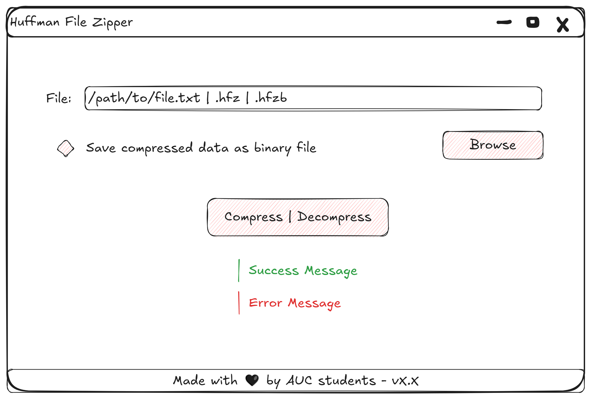

# Huffman File Zipper - Design Specifications - v1.0 (2024-11-15)

## Application Modules & Interfaces

- `MainWindow` class (inherits `QMainWindow` class)
- `HuffmanNode` struct
- `MinHeap` class
- `HuffmanTree` class
- `FileDealer` class

## Class Diagram

## UI Wireframes

#### MainWindow

